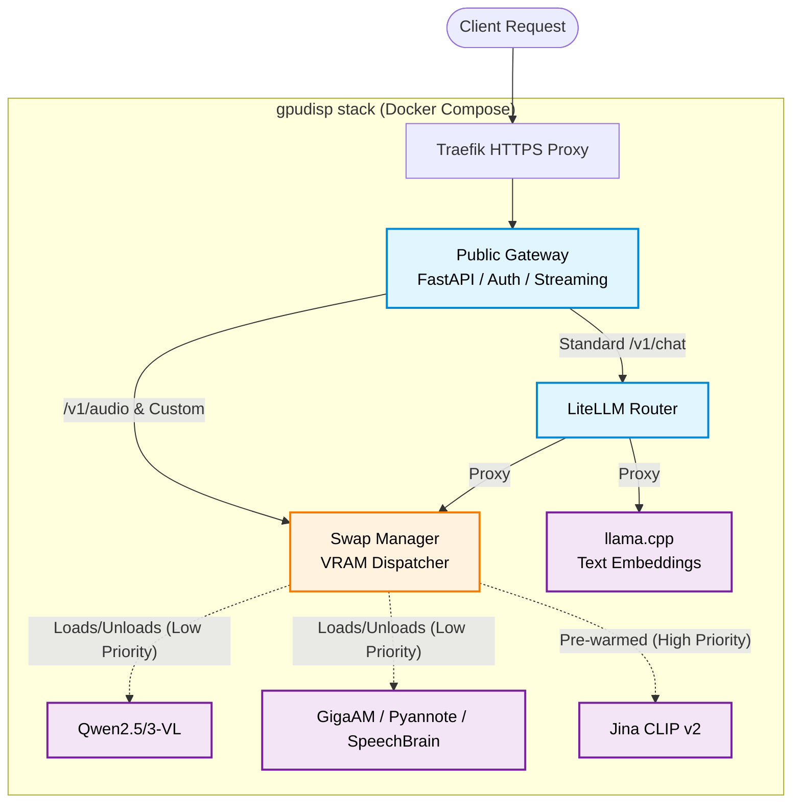

# gpudisp: VRAM Swap Manager & API Gateway 🚀

[](https://python.org)
[](https://fastapi.tiangolo.com)
[](https://www.docker.com/)

> 🇷🇺 **TL;DR на русском:**
> Проект решает проблему Out-Of-Memory при запуске тяжелого зоопарка моделей (LLM, Vision, Audio) на одной видеокарте 16 ГБ.
> Ядро системы — кастомный диспетчер памяти (`swap_manager`), который динамически загружает и выгружает модели из VRAM на основе приоритетов и таймаутов простоя. Вся сложная логика маршрутизации и ожидания загрузки весов скрыта за единым OpenAI-совместимым API (через LiteLLM и FastAPI).

**gpudisp** is a dynamic GPU resource dispatcher that enables running multiple heavy machine learning models (Text, Vision, Audio) concurrently on a single consumer-grade GPU without OOM crashes. 

It intelligently loads and unloads models from VRAM based on priority, idle timeouts, and active requests, exposing a unified OpenAI-compatible API.

## 🧠 Core Logic: VRAM Swap Manager
Since a single 16GB GPU cannot hold all models simultaneously, the custom `swap_manager` acts as a traffic controller:
* **High Priority (Pre-warmed):** Lightweight models (e.g., `jina-clip-v2` for image embeddings) are loaded on startup and never unloaded.
* **Low Priority (On-Demand):** Heavy models (e.g., `Qwen2.5-VL`, `GigaAM`) are loaded upon request and automatically unloaded after a configured `idle_timeout_sec`.
* **VRAM Guard:** Before starting a new model, the manager checks available VRAM. If insufficient, it forcefully suspends inactive low-priority models to make room.

## **🏗 Architecture**



### Component Breakdown

* **Public Gateway (FastAPI):** The public-facing entry point. It handles API key authentication, request sanitization, and SSE (Server-Sent Events) response streaming.
* **LiteLLM Router:** Standardizes all requests. It routes standard OpenAI-compatible calls to either the lightweight text embedding service or the heavy Swap Manager.
* **Swap Manager:** The core VRAM dispatcher. It monitors available GPU memory, dynamically starts heavy model backends on demand, and gracefully shuts them down when idle.
* **Model Backends:**
    * *LlamaCPP:* Runs the Qwen3 text embedding model continuously.
    * *Qwen-VL:* Spun up dynamically for multimodal vision tasks.
    * *Audio:* Custom pipelines for GigaAM transcription and Pyannote diarization.
    * *Jina CLIP:* Pre-warmed image embedding model kept in memory for high-priority tasks.

## **✨ Key Features**

> * **Multi-Modal Support out-of-the-box:** \
  * *Vision LLMs:* Qwen2.5-VL, Qwen3-VL (GGUF via llama.cpp)  
  * *Audio Analysis:* GigaAM (transcription), Pyannote/SpeechBrain (diarization, speaker embeddings, gender classification)  
  * *Embeddings:* Qwen3 (text), Jina CLIP v2 (images)  
> * **OpenAI-Compatible API:** Wraps multiple disparate backends into standard /v1/chat/completions and /v1/embeddings endpoints using LiteLLM.  
> * **Production-Ready Gateway:** Includes an async API gateway handling authentication, request sanitization, error handling, and response streaming.  
> * **Custom Audio Processing:** Patched torchaudio and huggingface\_hub implementations to ensure stable GigaAM transcription and agglomerative clustering for diarization fallbacks.

## **🛠 Tech Stack**

> * **ML & Inference:** PyTorch, Transformers, llama.cpp, SpeechBrain, Pyannote, scikit-learn.  
> * **Backend:** Python 3.12, FastAPI, Uvicorn, httpx, LiteLLM.  
> * **Infrastructure:** Docker, Docker Compose, NVIDIA Container Toolkit, Traefik, bash scripting.

## **🚀 API Example**

Because the service is fully OpenAI-compatible, you can use standard clients (like curl, openai-python, or LangChain) to interact with it:  
```bash
curl [https://gpudisp.example.com/v1/chat/completions](https://gpudisp.example.com/v1/chat/completions) \
  -H "Authorization: Bearer YOUR_MASTER_KEY" \
  -H "Content-Type: application/json" \
  -d '{
    "model": "qwen3-vl",
    "messages": [
      {
        "role": "user",
        "content": "Describe the architecture of this service."
      }
    ]
  }'
```
